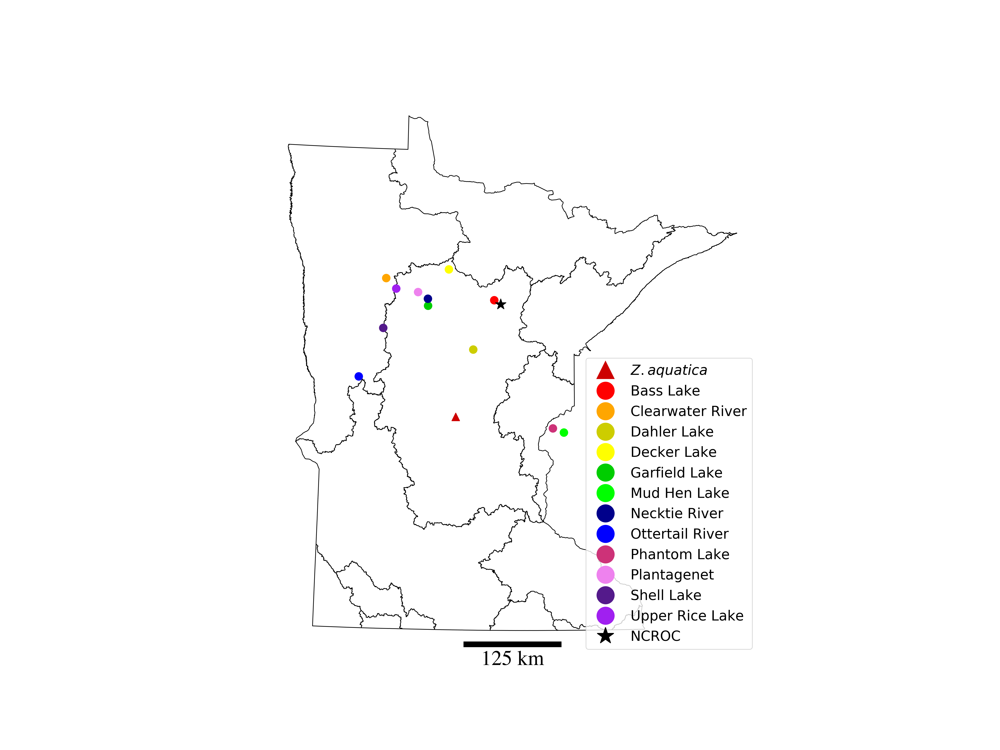
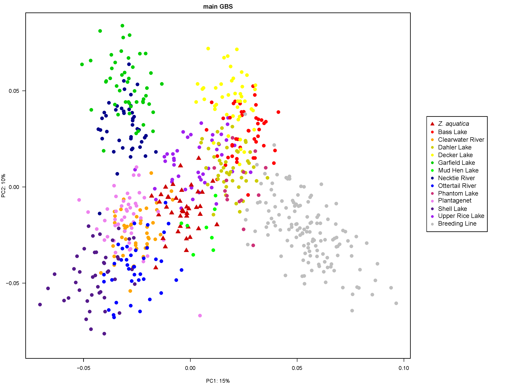
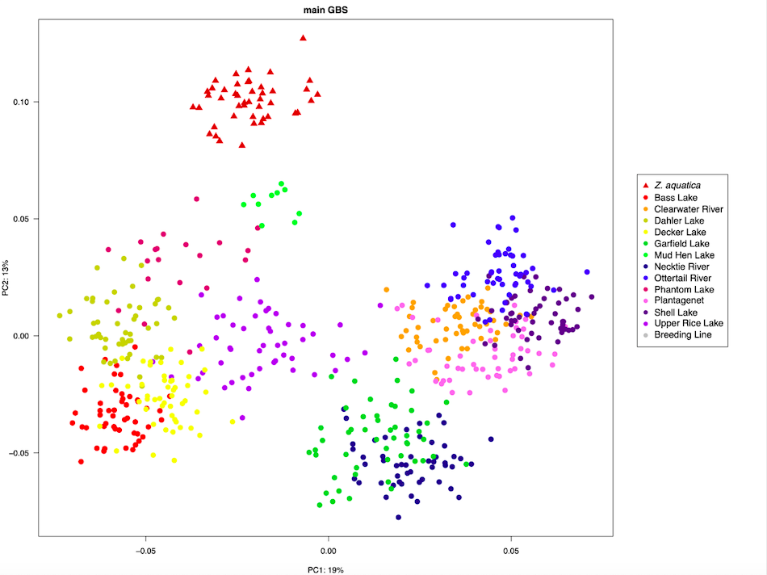
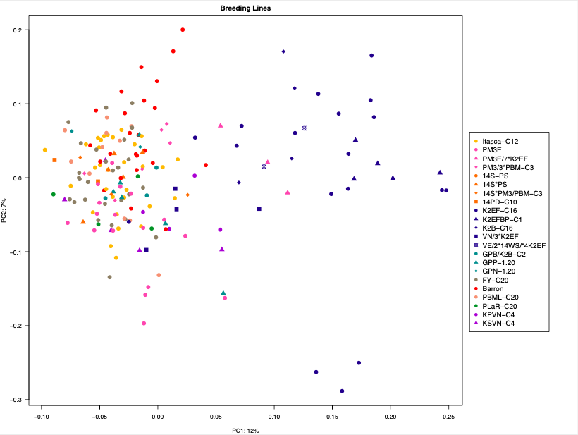
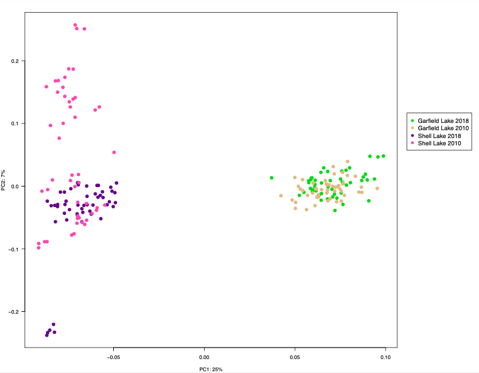
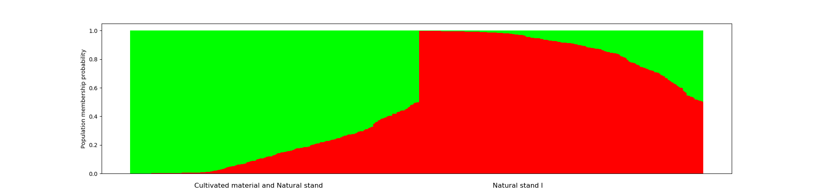
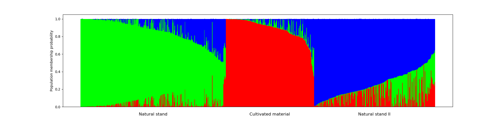
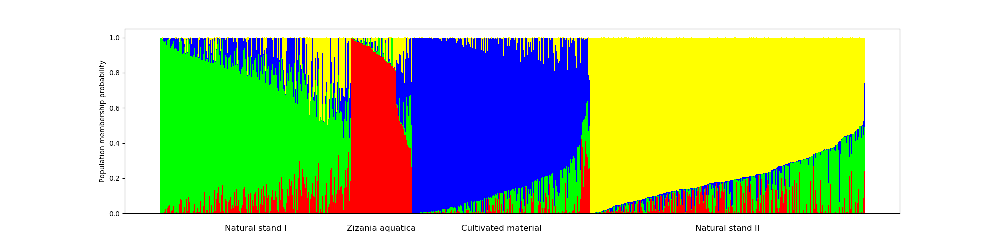
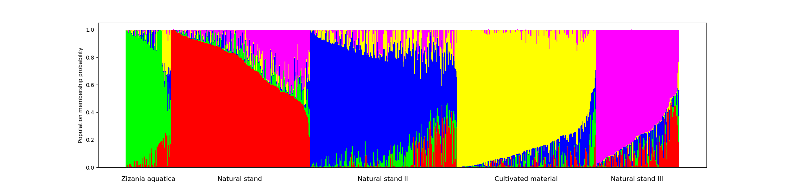
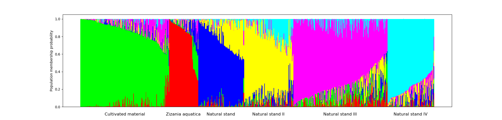

# README for genetic_diversity
This repository contains all of the scripts that were used to develop the genotyping-by-sequencing (GBS) pipeline for the wild rice (_Zizania palustris_ L.) breeding and conservation program at the University of Minnesota.

# Directory
## Figures
1. [Figure 1](#Figure-1)
2. [Figure 2a](#Figure-2a)
3. [Figure 2b](#Figure-2b)
4. [Figure 2c](#Figure-2c)
5. [Figure 3](#Figure-3)
6. [Figure 5a](#Figure-5a)
7. [Figure 5b](#Figure-5b)
8. [Figure 5c](#Figure-5c)
9. [Figure 5d](#Figure-5d)
10. [Figure 5e](#Figure-5e)

## Tables
1. [Table 1](#Table-1)
2. [Table 2](#Table-2)

We used multiple SNP-calling pipelines in the development of this project.
1. [SAMtools/BCFtools](SAMtools-BCFtools)
2. [FreeBayes](FreeBayes)

The goal of each of these pipelines was to generate a Variant Call Format (VCF) file containing SNP data for our population to be used in further analysis.

Principal Component Analysis (PCA) plots were generated using [PLINK](http://zzz.bwh.harvard.edu/plink/) version 1.90b6.10. Those files can be found [here](plink_files).

The directory [imputation](imputation) contains scripts to impute missing genotype calls, although these were not used in the final analysis.

The directory [pop_gen_analyses](pop_gen_analyses) contains scripts used to conduct many of the population genetic analyses for this project.

The directory [umgc_pilot_study](umgc_pilot_study) contains some scripts that were used in the pilot GBS study by [Shao _et al._ (2020)](https://link.springer.com/content/pdf/10.1007/s12686-019-01116-9.pdf).

**Genome stats:**<br>
The script [merge_fastq_read_counts.py](merge_fastq_read_counts.py) was used to merge the fastq read counts from each of the reports from two sequening runs ([file 1](Sequencing_report_data/190730_A00223_0174_BHCN5GDRXX_metrics.csv) and [file 2](Sequencing_report_data/190819_A00223_0191_AHF3V3DRXX_metrics.csv) and sum them based on sample identity. The average read count from the FASTQC report (this one run by the University of Minnesota Genomics Center) was 2.1 million reads/sample. I used the [CSV output file](Sequencing_report_data/merged_fastq_sequence_counts.csv) from this script to reaffirm the average count of 2.1 million reads/sample and to find the total read count (1.8 billion reads for 873 samples). We filtered out some samples which were included in the sequencing run, but which were not part of the diversity study. This was done in Excel using the ```VLOOKUP()``` function on the [sample key](191021_main_GBS_sample_key_PBML-C20_renamed.csv).

# Figures
### Figure 1
This figure shows the location of collection sites on public, non-tribal land in Minnesota and Wisconsin. The map uses watershed boundaries provided by the Minnesota Department of Natural Resources.<br>


### Figure 2a
Principal component analysis plot (PC1 vs PC2) for the complete set<br>


### Figure 2b
Principal component analysis plot (PC1 vs PC2) for the natural stands only<br>


### Figure 2c
Principal component analysis plot (PC1 vs PC2) for the cultivated material only<br>


### Figure 3
Principal component analysis plot (PC1 vs PC2) for the temporal samples<br>


**Figure 4**<br>

### Figure 5a
STRUCTURE results for _K_ = 2<br>


### Figure 5b
STRUCTURE results for _K_ = 3<br>


### Figure 5c
STRUCTURE results for _K_ = 4<br>


### Figure 5d
STRUCTURE results for _K_ = 5<br>


### Figure 5e
STRUCTURE results for _K_ = 6<br>


# Tables

### Table 1
The Transition/Transversion ratios were generated using the script [calculate_TsTv_vcftools.sh](vcftools_scripts_incl_nonbiallelic/calculate_TsTv_vcftools.sh). Additional details can be found within the directory containing the script.
<!---
Note: In order to get non-breaking white space in 'original scaffold name' and 'genome wide', I had to hold down the alt/option button on my Mac while typing the space. Otherwise the table looks ugly due to text wrapping for those columns. Other computer types like a PC may have different keystrokes to achieve same goal.
-->
| Statistic | ZPchr0001 | ZPchr0002 | ZPchr0003 | ZPchr0004 | ZPchr0005 | ZPchr0006 | ZPchr0007 | ZPchr0008 | ZPchr0009 | ZPchr0010 | ZPchr0011 | ZPchr0012 | ZPchr0013 | ZPchr0014 | ZPchr0015 | ZPchr0016 | ZPchr0458 | Genome wide
| :--- | ---: | ---: | ---: | ---: | ---: | ---: | ---: | ---: | ---: | ---: | ---: | ---: | ---: | ---: | ---: | ---: | ---: | ---: |
| Original scaffold name | Scaffold_13 | Scaffold_93 | Scaffold_3 | Scaffold_18 | Scaffold_1065 | Scaffold_48 | Scaffold_1063 | Scaffold_1062 | Scaffold_1 | Scaffold_70 | Scaffold_9 | Scaffold_415 | Scaffold_1064 | Scaffold_693 | Scaffold_7 | Scaffold_51 | Scaffold_453 | NA |
| Scaffold size (bp) | 95,470,783 | 103,377,072 | 58,865,324 | 98,769,966 | 66,616,710 | 118,006,097 | 42,614,780 | 75,690,682 | 95,187,837 | 111,429,323 | 63,217,741 | 105,879,435 | 111,260,184 | 24,058,870 | 39,125,943 | 13,817,767 | 4,333,358 | 1,227,721,872 |
| Number of SNPs | 483 | 435 | 302 | 491 | 350 | 598 | 181 | 367 | 481 | 568 | 285 | 410 | 583 | 91 | 237 | 88 | 5 | 5,955 |
| SNP density (SNPs/Mb) | 5.06 | 4.21 | 5.13 | 4.97 | 5.25 | 5.07 | 4.25 | 4.85 | 5.05 | 5.10 | 4.51 | 3.87 | 5.24 | 3.78 | 6.06 | 6.37 | 1.15 | 4.85 |
|  A/C | 40 | 33 | 30 | 38 | 17 | 60 | 23 | 29 | 44 | 49 | 21 | 25 | 43 | 7 | 15 | 6 | 0 | 480 |
| A/G | 169 | 171 | 108 | 205 | 147 | 197 | 57 | 128 | 181 | 213 | 109 | 149 | 234 | 30 | 92 | 40 | 2 | 2232 |
| A/T | 22 | 16 | 12 | 18 | 17 | 26 | 10 | 13 | 16 | 25 | 18 | 21 | 23 | 3 | 9 | 1 | 1 | 251 |
| C/G | 19 | 19 | 17 | 19 | 13 | 34 | 17 | 16 | 17 | 31 | 8 | 28 | 28 | 4 | 10 | 4 | 0 | 284 |
| C/T | 197 | 174 | 109 | 178 | 131 | 233 | 58 | 152 | 196 | 210 | 114 | 154 | 212 | 39 | 98 | 31 | 1 | 2287 |
| G/T | 36 | 22 | 26 | 33 | 25 | 48 | 16 | 29 | 27 | 40 | 15 | 33 | 43 | 8 | 13 | 6 | 1 | 421 |
| Transitions (Ts) | 366 | 345 | 217 | 383 | 278 | 430 | 115 | 280 | 377 | 423 | 223 | 303 | 446 | 69 | 190 | 71 | 3 | 4519 |
| Transversions (Tv) | 117 | 90 | 85 | 108 | 72 | 168 | 66 | 87 | 104 | 145 | 62 | 107 | 137 | 22 | 47 | 17 | 2 | 1436 |
| TsTv ratio | 3.13 | 3.83 | 2.55 | 3.55 | 3.86| 2.56 | 1.74 | 3.22 | 3.63 | 2.92 | 3.60 | 2.83 | 3.26 | 3.14 | 4.04 | 4.18 | 1.50 | 3.15 |

### Table 2
Analysis of Molecular Variance (AMOVA). The AMOVA was performed using the [AMOVA.R](pop_gen_analyses/AMOVA/AMOVA.R) R script launched by [run_AMOVA.sh](pop_gen_analyses/AMOVA/run_AMOVA.sh).

| Grouping | Source of variation | df | MS | Sigma | % | Probability |
| :--- | :--- | ---: | ---: | ---: | ---: | ---: |
| Natural stands vs. Natural stands | Variations between individuals | 12 | 7440.64 | 133.71 | 8.10 | 0.001 |
|                                   | Variations within individuals  | 567 | 1516.08 | 1516.08 | 91.90 | 0.001 |
|                                   | Total variation                | 579 | 1638.87 | 1649.78 | 100.00 | 0.001 |
| Cultivated vs. Cultivated         | Variations between individuals | 20  | 1841.49  | 49.61   | 3.37 | 0.001 |
|                                   | Variations within individuals  | 166 | 1421.51 | 1421.51 | 96.63 | 0.001 |
|                                   | Total variation                | 186 | 1466.67 | 1471.11 | 100.00 | 0.001 |
| Natural stands vs. Cultivated     | Variations between individuals | 1 | 20,955.05 | 68.42 | 4.09 | 0.001 |
|                                   | Variations within indiviuduals | 765 | 1604.18 | 1604.17 | 95.91 | 0.001 |
|                                   | Total variation                | 766 | 1629.44 | 1672.60 | 100.00 | 0.001 |
| STRUCTURE grouping _K_ = 5        | Variations between individuals | 5 | 8508.68 | 57.96 | 3.53 | 0.001 |
|                                   | Variations within individuals  | 761 | 1584.24 | 1584.24 | 96.47 | 0.001 |
|                                   | Total variation                | 766 | 1629.44 | 1642.20 | 100.00 | 0.001 |

# Supplementary Figures

**Figure S1** Evanno method implemented by STRUCTURE harvester to show the ideal number of _K_ populations from STRUCTURE results<br>


**Figure S2** Temporal samples tree. This was produced with the same base scripts at the Cultivated and Natural Stands trees.


## awk_filtering_scripts (directory)
These scripts are short and simple awk commands to pre-filter the tab-separated (TSV) files that contain the output of the normalize.awk script. The normalize.awk script can be found in this repository and is used to extract SNP information from the VCF files.

## complete_gbs_set (directory)
These scripts were used to process the gbs data from the natural stands + breeding lines material (no Johnson/Dora population or Dovetail lines). Currently, the scripts pick up from VCF files (samtools mpileup & bcftools call script has already been run). The tsv file created with normalize.awk was 129G in size and one of the scripts here filters based on read depth (minimum of 5 reads).

## depth_reanalysis_pilot_data (directory)
Scripts for re-analyzing depth of pilot GBS data using the reference genome. Aim is to to calculate density of SNPs for use in genome paper.

## pairwise_distance (directory)
These scripts are for creating pairwise distance tables in R

## pca_from_poppr (directory)
These scripts are for creating a PCA plot with the R package poppr. It was created when I began investigations into low Fst values (0.03-0.05) which were calculated using VCFtools. The plots look similar to the one created using PLINK, but explain less of the variation. That matches the low Fst values, but based on previous research we expect an Fst value closer to 0.3, so these files should ultimately be able to validate the PLINK results.

## plink_files (directory)
These scripts are for using plink to process/analyze large-scale GBS SNP data

## umgc_pilot_study (directory)
These scripts are for the (partial) re-analysis of the pilot GBS study conducted by the University of Minnesota Genomics Center (UMGC). I say partial because I start the re-analysis from the VCF files produced by their pipeline. For their pipeline, they used a program called stacks (http://catchenlab.life.illinois.edu/stacks/). The reference genome of _Zizania palustris_ was not used in this pipeline. I was mostly interested in pulling some stats out of the files and re-creating the PCA plot to meet my style preferences. The paper was accepted for publication in Conservation Genetics Resources.

## 190515_cutadapt_pilot_GBS
This file is the "complete" GBS pipeline that was initiated on 15 May 2019. It can be broken down into a few major steps:
1. Removing adapter content with cutadapt
2. Running fastQC on trimmed reads
3. Aligning trimmed fastq reads to the genome with bwa-mem
  - Indexing genome
  - Performing alignment
  - Sorting BAM files
4. SNP calling with samtools mpileup/bcftools call
  - There are two parameters to pay especially close attention to.
    - The -q option for samtools mpileup allows us to specify a _minimum_ mapping quality. A minimum mapping quality value of 20 might be "standard", but I used a value of 60 for some interations of the experiment which might be a little too stringent and results in otherwise useful SNPs being filtered out of the dataset. (Reference: http://www.htslib.org/doc/samtools-1.2.html)
    - The -m option for bcftools call stands for the _multiallelic caller_. It is an alternative method for multi-allelic and rare-varient calling that overcomes known limitations to the -c option which stands for _consensus_ caller. The consensus caller is the original option. Because these options conflict with each other, only one can be used at a time.(Reference: https://samtools.github.io/bcftools/bcftools.html)
5. Pulling the SNP information out of the VCF files and into usable format
  - The script "normalize.awk" extracts the following information from the VCF files: 1) scaffold, 2) position, 3) reference allele, 4) alternate allele, 5) base quality score, 6) sample identifier (path to BAM file), 7) genotype call (0, 1, or 2), 8) read depth (DP) at site, and 9) depth of the varient (DV) allele at the site.

## 190913_pilot_GBS_snp_filtering_wide_format_q60.R
This file contains R code that reformats SNP data from the pilot study. It loads a pre-existing Rdata file and outputs a comma-separated (CSV) file. Otherwise, this code is pretty simple. It takes data in long format and converts it to wide format before writing the CSV file.
  - The input Rdata file is: 190627_snp_filtering_q60.Rdata
  - The output Rdata file is: 190913_pilot_GBS_snip_filtering_wide_format_q60.Rdata
  - The CSV file is: 190913_pilot_GBS_snp_filtering_wide_format_q60.csv
  
## 190913_snp_calling_from_190607_samtools_pilot_GBS.R
This file contains R code for generating a SNP table for the pilot study (excluding _Z. latifolia_).
  - Input Rdata file: 190607_snp_filtering.Rdata
  - Output Rdata file: 190913_snp_calling_from_190607_samtools_pilot_GBS.Rdata
  - Output CSV file: 190913_snp_calling_from_190607_samtools_pilot_GBS.csv
  
## 191002_pca_from_vcf_subset_of_main_GBS_data.R
The purpose of this code is to create a PCA plot directly from the VCF files for the first 50 samples of the main_GBS project. It only considered Scaffold_48. I used this approach because I was having a hard time getting all of the data to load and run at once without the system crashing.
  - Input files: 1) '191001_samtools_Scaffold_48;HRSCAF=1451.vcf.gz', 2) 191002_first_fifty_lines.csv
  - Output files: 1) 191002_pca_from_vcf_subset_of_main_GBS_data.pdf, 2) 191002_pca_from_vcf_subset_of_main_GBS_data.Rdata

## filter_vcf_by_maf.sh
This is a PBS batch script to filter (& recode) VCF files so that they are filtered for a minor allele frequency of at least 0.05. There is also a flag (--remove) along with a text file that contains the sample numbers (one per line) that belong to the Old Lake samples to remove them from consideration. The script does this individually for specific VCF files and then concatenates them into a larger VCF file to feed into either PLINK or the R package _poppr_.

## create_snp_list_from_plink
The purpose of this code is to use plink (http://zzz.bwh.harvard.edu/plink/) to create a SNP list (table).

## main_GBS_directory_setup.txt
The purpose of this code was to set up the directory structure for **main_GBS**. First, it creates a text file with the paths to the fastq files in the UMGC directory (_/home/jkimball/data_release/umgc/novaseq_). Please note that the UMGC released the GBS data in two waves. One set is in the directory **190730_A00223_0174_BHCN5GDRXX/Kimall_Project_002** while the other is in the directory **190819_A00223_0191_AHF3V3DRXX/Kimball_Project_002**.
  - The pilot data (**Kimball_Project_001**) are in a different directory because they were sequenced using the **NextSeq** platform. That path is: **181030_NB551164_0099_AHVM22BGX7/Kimball_Project_001**
  - The RNA-seq data are part of **Kimball_Project_003** and can be found in **190828_A00223_0198_BHCMFVDRXX/Kimball_Project_003**
  - _Please note that these are **relative** paths and assume you are already in the directory /home/jkimball/data_release/umgc/novaseq or /home/jkimball/data_release/umgc/nextseq (in the case of the pilot study)_.

The code then makes symbolic links (symlinks) to the fastq files in the directory _/home/jkimball/haasx092/**main_GBS**_. The fastq file names generally begin with a pattern like "18NS###" or "18BL##" with NS standing for "natural stand" and BL standing for "breeding line". We have information on where these come from, but to make computations easier (especially pattern matching), I wanted to use a number that was in the middle of the filename (S##). Leading zeros were added to the sample numbers so that all sample numbers would have 4 digits. This was done to make sorting of samples easier (so that the order would be: 1, 2, 3, etc and not 1, 10, 100).

A file (paths_to_gbs_data_check.txt) was also created to verify that the code worked. The result is that it worked as expected.

## main_GBS_pipeline
This code is very similar to the file **190515_cutadapt_pilot_GBS** but is a better reflection of what was done for the **main_GBS** analysis.

## pca_from_vcf.R
This is R code that generates a PCA plot directly from VCF files. It was first used for the pilot GBS project and it worked very well for those samples. The seventeen largest VCF files were concatenated into a single VCF file called **seventeen_largest_vcfs_merged.vcf.gz** using bcftools concat. That file was used as input to generate:
  - The PCA plot (190705_pilot_GBS_PCA.pdf); and
  - The Rdata file (190705_pca_from_vcfs.Rdata)
  
Please note that multiple different modules are required to be loaded on the command line before beginning the R session.

## plink_for_main_GBS
This file contains command line code that used plink to generate a PCA plot for the main GBS project.

It uses the seventeen largest VCFs (as was done with the pilot study) but these data came from the directory _190910_samtools_ which was the first attempt at the using the GBS pipeline for the main GBS dataset. The code was run in that directory.

Input files include:
  - Eigenvalue and eigenvector files made by plink (myplink_pca.eigenval & myplink_pca.eigenvec);
  - The sample key (191008_main_GBS_sample_key.csv)
  
Output files include:
  - One PCA plot (191008_main_GBS_pca_from_plink.pdf);
  - Another PCA plot, colored according to file name (191009_main_GBS_PCA_Itasca_and_JohnsonDoraF4.pdf);
  - The Rdata files (191008_main_GBS_pca_from_plink.Rdata & 191009_main_GBS_pca_from_plink.Rdata)
  
## plotting_dv-dp_ratios.r
This is R code that plots the DV/DP ratio for each sample in the pilot study. DV/DP stands for "depth of the variant/total depth". The purpose of the code was to verify the diploid nature of _Zizania palustris_ given that the genome size came back much larger than expected.

Input file:
  - An R data file containing filtered SNP data (190607_snp_filtering.Rdata)

Output file:
  - The plots (190609_pilot_GBS_samples_dv-dp_ratio.pdf)
  
## poppr_installation.R
This shows the steps that I took to install the R package "poppr" (https://cran.r-project.org/web/packages/poppr/index.html). It was more complicate than a standard R package. For the same reason, every time the package is used in R, the same software packages need to be re-loaded. I haven't needed to run this specific code again since I installed it the first time.

## run_bwa.sh
This is simply partial generic command-line code that runs the burrows-wheeler aligner (bwa; http://bio-bwa.sourceforge.net/). It is in a format that can be submitted to the Minnesota Supercomputing Institute (MSI) batch submission system. The basic code can also be found in the pilot GBS (**190515_cutadapt_pilot_GBS**) or main GBS (**main_GBS_pipeline**) files.

## scythe_mpileup.sh
This is a script written with the help of Tom Kono to run the samtools mpileup part of the GBS pipeline in a a better, more efficient way. When the samtools mpileup part of the pipeline is entered directly on the command line and subsequently put into the background, each samtools process runs for ~15 minutes before being killed by the server. **I think this is the ultimate cause of the low number of SNPs identified** When I tried to turn the script (as it was) into a batch submission script for MSI, I received an error (argument too long) which was caused by parallel, but when I took parallel out, the region option (-r '{}') was not recognized. This script has the same basic skeleton as before, but was reworked so that parallel could work with it. Otherwise (with the old script--parallel and the -r '{}' option removed), all of the variants are written to a single VCF file and takes longer than 24 hours to finish.. So scythe_mpileup.sh represents a major improvement.
